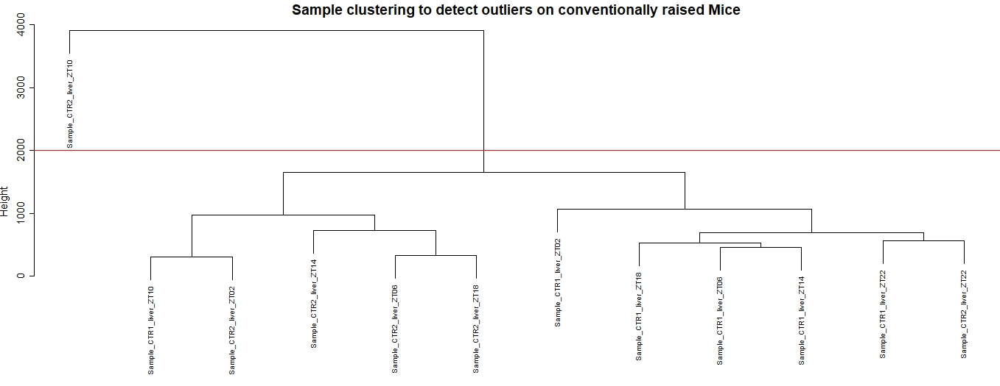
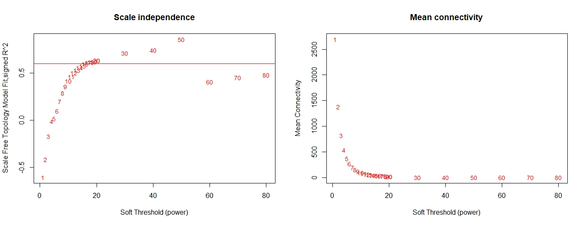
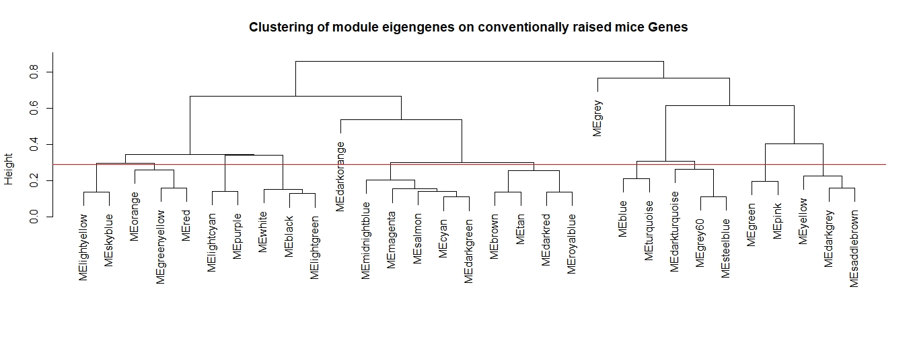
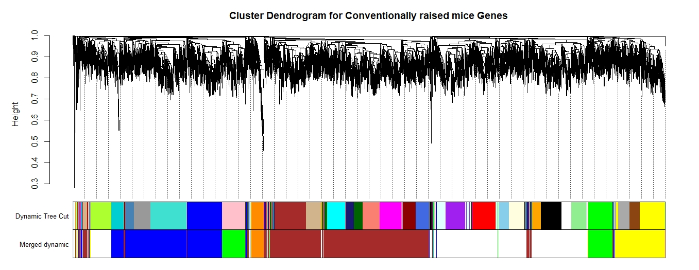
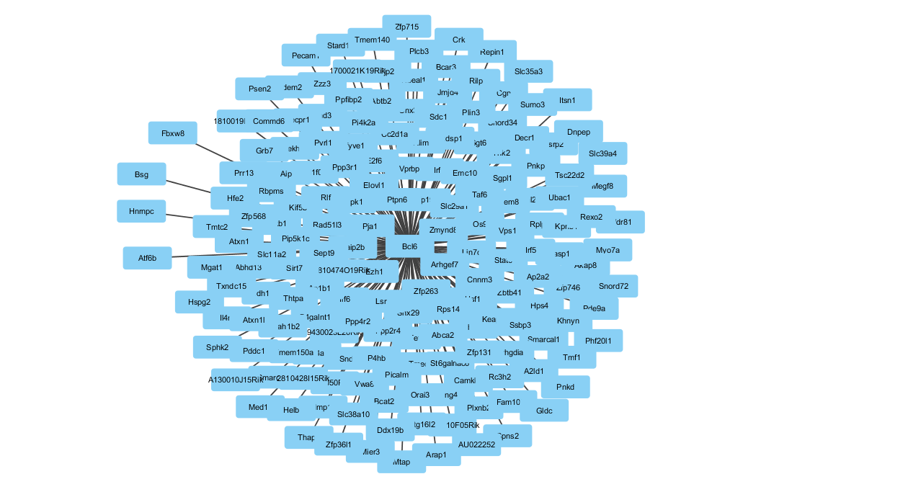
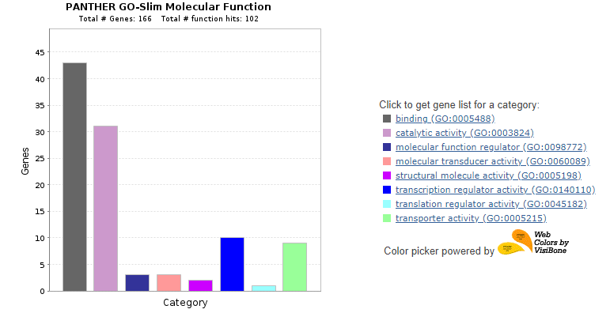

# Analysis-of-Hormones-and-the-Gut-Microbiome
Repo for Ricky Flores's BIOI 4890 Senior Project Spring 2020
Clone the repository or download the Zip file,
this folder will conatin all the necessary data
and R script which when run will generate the network
that can be imported to Cytoscape for Analysis.
This tutorial is for the generation of the conventually raised mouse gene co-expression network.<br>
<br>
Install the following packages if required.
```R
BiocManager::install("WGCNA")
if (!requireNamespace("BiocManager", quietly = TRUE))
install.packages("BiocManager")
BiocManager::install("DESeq2")
```
Set the working directory to file location, import the necessary libraries, and set options
```R
setwd(dirname(rstudioapi::getActiveDocumentContext()$path))
library(htmltools)
library('WGCNA')
library('tidyverse')
library(ggplot2)
library('DESeq2')
options(stringsAsFactors = FALSE);
workDir <- getwd()
```
Read in the Data
```R
Raw_Count <- read.delim(paste(workDir, "/GSE114400_raw_exon_male_liver.txt", sep = ''))
Female_Raw_Count <- read.delim(paste(workDir, "/GSE114400_raw_exon_female.txt", sep = ''))
GH <- read.delim(paste(workDir, "/GSE114610_raw_exon_GH.txt", sep = ''))
```
Seperate each sample type
```R
convR <- data.frame(select(Raw_Count,1,2,3:14))
GF <- data.frame(select(Raw_Count,1,2,15:26))
Female_convR <- data.frame(select(Female_Raw_Count,1,2,3:14))
Female_GF <- data.frame(select(Female_Raw_Count,1,2,15:26))
```
Data cleaning and normalization
```R
## Take Average of every row for both experiments
convR <- data.frame(gene=convR[,1], ExonLength = convR[,2], select(convR,3:14), Average=rowMeans(convR[3:14]))
GF <- data.frame(gene=GF[,1], ExonLength = GF[,2], select(GF,3:14), Average=rowMeans(GF[3:14]))
GH <- data.frame(gene=GH[,1], ExonLength = GH[,2], select(GH,3:13), Average=rowMeans(GH[3:13]))

Female_convR <- data.frame(gene=Female_convR[,1], ExonLength = Female_convR[,2], select(Female_convR,3:14), Average=rowMeans(Female_convR[3:14]))
Female_GF <- data.frame(gene=Female_GF[,1], ExonLength = Female_GF[,2], select(Female_GF,3:14), Average=rowMeans(Female_GF[3:14]))

## Remove values with an average count less than 500
convR <- convR[!(convR$Average < 500),]
GF <- GF[!(GF$Average < 500),]
GH <- GH[!(GH$Average < 500),]
Female_convR <- Female_convR[!(Female_convR$Average < 500),]
Female_GF <- Female_GF[!(Female_GF$Average < 500),]

##Expression Value
convR <- data.frame(gene=convR[,1], convR[,3:14] / convR[,2])
GF <- data.frame(gene=GF[,1], GF[,3:14] / GF[,2])
GH <- data.frame(gene=GH[,1], GH[,3:13] / GH[,2])
Female_convR <- data.frame(gene=Female_convR[,1], Female_convR[,3:14] / Female_convR[,2])
Female_GF <- data.frame(gene=Female_GF[,1], Female_GF[,3:14] / Female_GF[,2])

##Data formatting

convR <- separate(convR, "gene", c("probe", "gene_symbol"), sep = '\\|')
GF <- separate(GF, "gene", c("probe", "gene_symbol"), sep = '\\|')
GH <- separate(GH, "gene", c("probe", "gene_symbol"), sep = '\\|')
Female_convR <- separate(Female_convR, "gene", c("probe", "gene_symbol"), sep = '\\|')
Female_GF <- separate(Female_GF, "gene", c("probe", "gene_symbol"), sep = '\\|')

convR_samples_genes <- convR[c(1,2)]
gf_samples_genes <- GF[c(1,2)]
GH_samples_genes <- GH[c(1,2)]
Female_convR_samples_genes <- Female_convR[c(1,2)]
Female_gf_samples_genes <- Female_GF[c(1,2)]

rownames(convR) <- convR[,1]
rownames(GF) <- GF[,1]
rownames(GH) <- GH[,1]
rownames(Female_convR) <- Female_convR[,1]
rownames(Female_GF) <- Female_GF[,1]

convR[,1] <- NULL
convR[,1] <- NULL
GF[,1] <- NULL
GF[,1] <- NULL
GH[,1] <- NULL
GH[,1] <- NULL
Female_convR[,1] <- NULL
Female_convR[,1] <- NULL
Female_GF[,1] <- NULL
Female_GF[,1] <- NULL
##Transpose the data for analysis
convR <- t(convR)
GF <- t(GF)
GH <- t(GH)
Female_convR <- t(Female_convR)
Female_GF <- t(Female_GF)
```
Check for missing values (Should return True)
```R
gsg = goodSamplesGenes(convR, verbose = 3);
gsg$allOK
gsg = goodSamplesGenes(GF, verbose = 3);
gsg$allOK
gsg = goodSamplesGenes(GH, verbose = 3);
gsg$allOK
```
Network Generation<br>
<br>
First select which network you wish to create.<br>
[1]Conventionally Rasied Male Mice = convR<br>
[2]Germ Free Rasied Male Mice = GF<br>
[3]Growth Hormone Treated Male Mice = GH<br>
[4]Conventionally Rasied Female Mice = Female_convR<br>
[5]Germ Free Rasied Female Mice = Female_GF<br>
For this walkthrough we will be using Conventionally Rasied Male Mice
```R
datExpr0 = convR
```
Cluster to detect and remove outliers
```R
sampleTree1 = hclust(dist(datExpr0), method = "average");
sizeGrWindow(12,9)
par(cex = 0.6);
par(mar = c(0,4,2,0))
plot(sampleTree1, main = "Sample clustering to detect outliers", sub="", xlab="", cex.lab = 1.5,
     cex.axis = 1.5, cex.main = 2)

# We detect one outlier in the data for ConvR mice
# Plot a line to show the cut
abline(h = 3000, col = "red");
# Determine cluster under the line
clust1 = cutreeStatic(sampleTree1, cutHeight = 3000, minSize = 10)
table(clust1)
# clust 1 contains the samples we want to keep.
keepSamples = (clust1==1)

datExpr = datExpr0[keepSamples, ]
```
The following shows the sampling of samples and for conventually rasied mice 1 outlier is dtected and removed from the rest of the network generation. 


Uncomment the following code if you wish to save all samples.<br>
A count of the genes and samples will be recorded
```R
###IF No Samples need to be removed
#datExpr = datExpr0
nGenes = ncol(datExpr)
nSamples = nrow(datExpr)
```
The rest of the walkthrough will incorperate multithreading.
```R
enableWGCNAThreads()
```
Determine a soft-threshold, the following will generate a recommendation based on the toplogical analysis
```R
powers = c(c(1:20), seq(from = 20, to=80, by=10))
sft = pickSoftThreshold(datExpr, powerVector = powers, verbose = 5)
# Plot the results:
sizeGrWindow(9, 5)
par(mfrow = c(1,2));
cex1 = 0.9;
plot(sft$fitIndices[,1], -sign(sft$fitIndices[,3])*sft$fitIndices[,2],
     xlab="Soft Threshold (power)",ylab="Scale Free Topology Model Fit,signed R^2",type="n",
     main = paste("Scale independence"));
text(sft$fitIndices[,1], -sign(sft$fitIndices[,3])*sft$fitIndices[,2],
     labels=powers,cex=cex1,col="red");
abline(h=0.6,col="red")
plot(sft$fitIndices[,1], sft$fitIndices[,5],
     xlab="Soft Threshold (power)",ylab="Mean Connectivity", type="n",
     main = paste("Mean connectivity"))
text(sft$fitIndices[,1], sft$fitIndices[,5], labels=powers, cex=cex1,col="red")
```


Based on the topological Analysis we chose a soft-power of 16 as seen in the image above.
and generate the adjacency matrix.
```R
softpower = 16
adjacency = adjacency(datExpr, power = softpower)
```
Create a Topological Overlap Matrix to cluters similar genes.
```R
TOM = TOMsimilarity(adjacency);
dissTOM = 1-TOM

geneTree = hclust(as.dist(dissTOM), method = "average");

sizeGrWindow(12,9)
plot(geneTree, xlab="", sub="", main = "clustering on TOM-based dissimilarity",
     labels = FALSE, hang = 0.06);


minModuleSize = 100;

dynamicMods = cutreeDynamic(dendro = geneTree, distM = dissTOM,
                            deepSplit = 2, pamRespectsDendro = FALSE,
                            minClusterSize = minModuleSize);
table(dynamicMods)

dynamicColors = labels2colors(dynamicMods)
table(dynamicColors)

sizeGrWindow(8,6)
plotDendroAndColors(geneTree, dynamicColors, "Dynamic Tree Cut",
                    dendroLabels = FALSE, hang = 0.06,
                    addGuide = TRUE, guideHang = 0.08,
                    main = "Gene dendrogram and module colors")
```
Merge expression profiles based on the eigengenes.
```R
MEList = moduleEigengenes(datExpr, colors = dynamicColors)
MEs = MEList$eigengenes

MEDiss = 1-cor(MEs);

METree = hclust(as.dist(MEDiss), method = "average");

sizeGrWindow(7, 6)
plot(METree, main = "Clustering of module eigengenes",
     xlab = "", sub = "")

MEDissThres = 0.32

abline(h=MEDissThres, col = "red")

merge = mergeCloseModules(datExpr, dynamicColors, cutHeight = MEDissThres, verbose = 3)
# Merged module colors
mergedColors = merge$colors;

mergedMEs = merge$newMEs

sizeGrWindow(12, 9)

plotDendroAndColors(geneTree, cbind(dynamicColors, mergedColors),
                    c("Dynamic Tree Cut", "Merged dynamic"),
                    dendroLabels = FALSE, hang = 0.06,
                    addGuide = TRUE, guideHang = 0.08,
                    main = "Cluster Dendrogram")

moduleColors = mergedColors
colorOrder = c("grey", standardColors(50));
moduleLabels = match(moduleColors, colorOrder)-1;
MEs = mergedMEs
```
The clustering of gene modules following along with the following results.


The final Topological Overlap Matrix with merged modules that will be exported.

Export the Topological Overlap Matrix to a text file which can be imported to Cytoscape
```R
##Check MEs to detrermine the possible modules that can be transferred to Cytoscape
modules = c("darkorange", "midnightblue", "blue", "white", "green", "yellow", "grey")


probes = Female_gf_samples_genes$probe
inModule = is.finite(match(moduleColors, modules))
modProbes = probes[inModule]
modGenes = Female_gf_samples_genes$gene_symbol[match(modProbes, Female_gf_samples_genes$probe)]

modTOM = TOM[inModule, inModule]
dimnames(modTOM) = list(modProbes, modProbes)

cyt = exportNetworkToCytoscape(modTOM,
                               edgeFile = paste("Results/CytoscapeInput-edges-", paste(modules, collapse="-"), ".txt", sep=""),
                               nodeFile = paste("Results/CytoscapeInput-nodes-", paste(modules, collapse="-"), ".txt", sep=""),
                               weighted = TRUE,
                               threshold = 0.02,
                               nodeNames = modProbes,
                               altNodeNames = modGenes,
                               nodeAttr = moduleColors[inModule])

```
The files generated under Code/Results can now be imported into cytoscape to create the complete network.<br>
Import the edge file to Cytoscape<br>
Set the following in Cytoscape for each network: 
weight = Edge Attribute<br>
fromAltName = Source Node<br>
toAltName = Target Node<br>
fromNode = Source Node Attribute<br>
toNode = Target Node Attribute<br>

Using Cytoscape we filtered under the gene Bcl6 to create induced subnetworks for genes co-expressed with Bcl6 which can be seen below


<br>
Functional Analysis<br>
<br>
Using Cytoscape we export the list do genes and perform a functional analysis using PANTHER<br>
http://www.pantherdb.org/<br>
The following is the functional analysis

